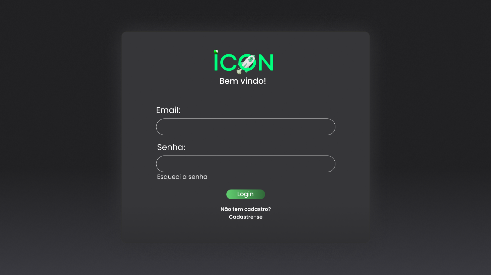
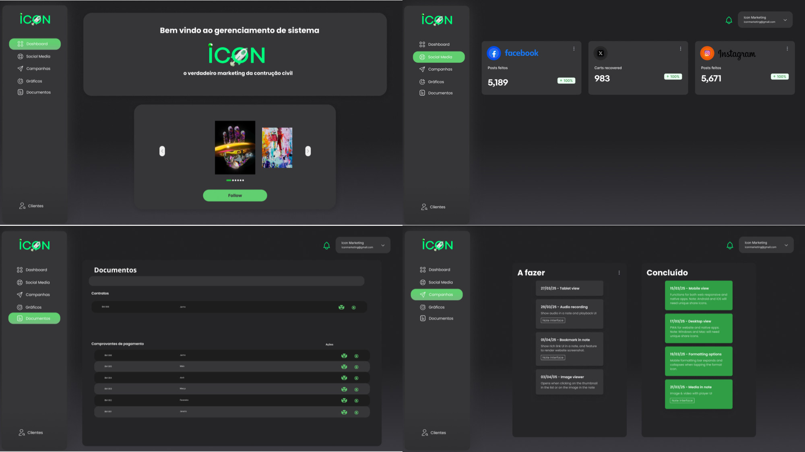
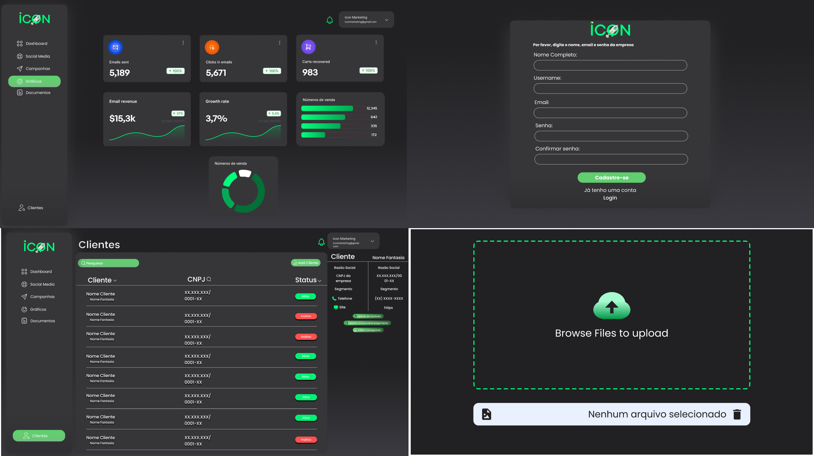
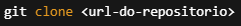
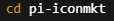
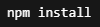
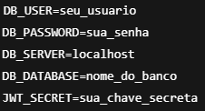
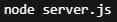
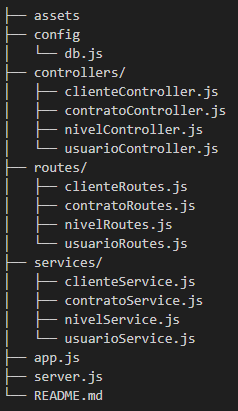

# Icon Marketing – Plataforma de Gestão

Sistema desenvolvido para gerenciamento de clientes, contratos, usuários e níveis de acesso em uma empresa de marketing digital. A plataforma permite a centralização de informações e controle de acessos com foco na automação e eficiência operacional.

## ✨ Funcionalidades

As funcionalidades já implementadas incluem:

- **Login de usuário**
- **Cadastro de usuários com níveis de acesso**
- **CRUD de clientes**
- **CRUD de contratos**
- **Associação de contratos a clientes**
- **Cadastro e gerenciamento de níveis de acesso**

## ⚙️ Tecnologias Utilizadas

- **Linguagem:** JavaScript (Node.js v22.15.0)
- **Framework:** Express.js
- **Banco de Dados:** SQL Server (acessado via biblioteca `mssql`)
- **Gerenciamento de ambiente:** dotenv
- **Autenticação:** JSON Web Token (JWT)
- **Outras bibliotecas:** body-parser, cors, dotenv

## 🎨 Layout

### Web

  

  

  

## 🚀 Como Executar

### Pré-requisitos

- Node.js (versão mínima recomendada: 18.x)
- Banco de dados SQL Server configurado
- Editor de código (sugestão: Visual Studio Code)

### Passos

1. Clone o repositório:

  

2. Acesse a pasta do projeto:

  

3. Instale as dependências:

  

4. Crie um arquivo .env com as variáveis de conexão com o banco:

  

5. Inicie o servidor:

  

6. Acesse em: http://localhost:3000

🔒 Segurança

A aplicação utiliza autenticação com JSON Web Tokens (JWT) para controle de acesso. Os tokens são verificados em rotas protegidas garantindo que apenas usuários autenticados e autorizados possam acessar funcionalidades restritas. Há implementação de níveis de acesso para controlar permissões de acordo com o perfil do usuário.

📊 Indicadores (KPIs)

Embora o sistema ainda não tenha dashboards implementados, os KPIs previstos para futuras versões incluem:

Quantidade de clientes ativos

Quantidade de contratos ativos

Tempo médio de contrato

Taxa de renovação de contratos

Indicadores de ROI e CPC por cliente (futuramente integráveis)

📁 Estrutura de Pastas

📌 Requisitos

Node.js: versão 18.x ou superior

Dependências essenciais:

express

mssql

dotenv

jsonwebtoken

cors

body-parser

Arquivo .env obrigatório com dados de conexão ao banco e chave JWT.

✍️ Autoria

Alunos: Elton Godoy, Gustavo Nascimento, Jonas Cabral, Jonathan Saraiva, José Valter Pereira, Lauriane Venancio

Tutor: Pamella Pereto